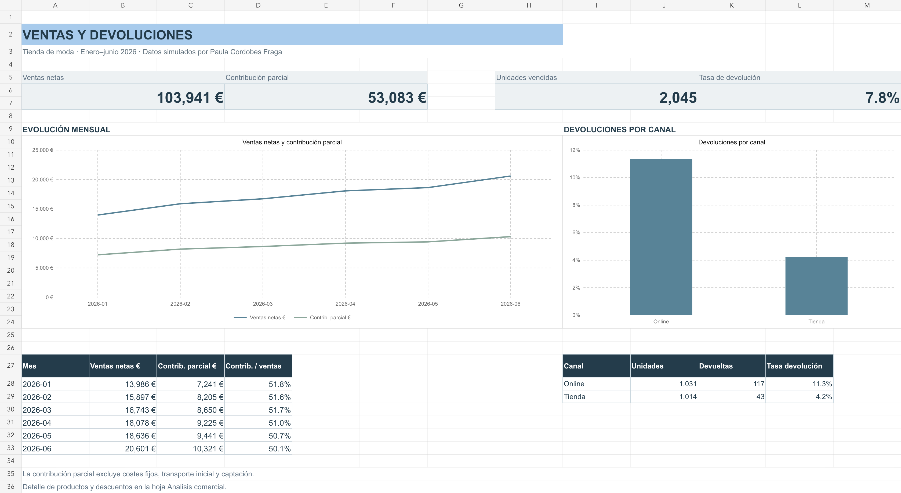

# Paula Cordobes Fraga — Portfolio

**Comercio · Retail · Branding · Interés en marketing digital**

### [Visitar el portfolio ↗](https://paulacordobesfraga.github.io/)

Formación, certificaciones, competencias y un proyecto práctico de análisis comercial en Excel.

[LinkedIn](https://www.linkedin.com/in/paula-cordob%C3%A9s-fraga-508a6a265/) · [Perfil de GitHub](https://github.com/PaulaCordobesFraga)

---

## Proyecto destacado

### Retail Lab — Ventas & Customer Experience

Caso práctico con **1.500 pedidos simulados**, cuatro hojas de Excel, siete gráficos y cinco tablas con filtros. Conecta ventas, descuentos y devoluciones con un simulador del volumen necesario para mantener la contribución de una promoción.

[Descargar Excel](https://paulacordobesfraga.github.io/retail-lab/Retail-Lab-Excel.xlsx) · [Repositorio del proyecto](https://github.com/PaulaCordobesFraga/Retail-Lab-Excel)

Los datos son simulados. La contribución es parcial; el simulador calcula un umbral contable, no una previsión de demanda ni el impacto real de una campaña.

## Contenido y mantenimiento

- `index.html`: contenido del portfolio.
- `style.css`: diseño y adaptación a móvil.
- `paula-cordobes-fraga.jpeg`: retrato proporcionado, sin recompresión.
- `retail-lab/Retail-Lab-Excel.xlsx`: libro de Excel descargable.
- `retail-excel-preview.png`: vista previa del proyecto.

Sitio estático publicado con GitHub Pages desde la rama `main`, carpeta raíz. La dirección corresponde a la cuenta **PaulaCordobesFraga**.
